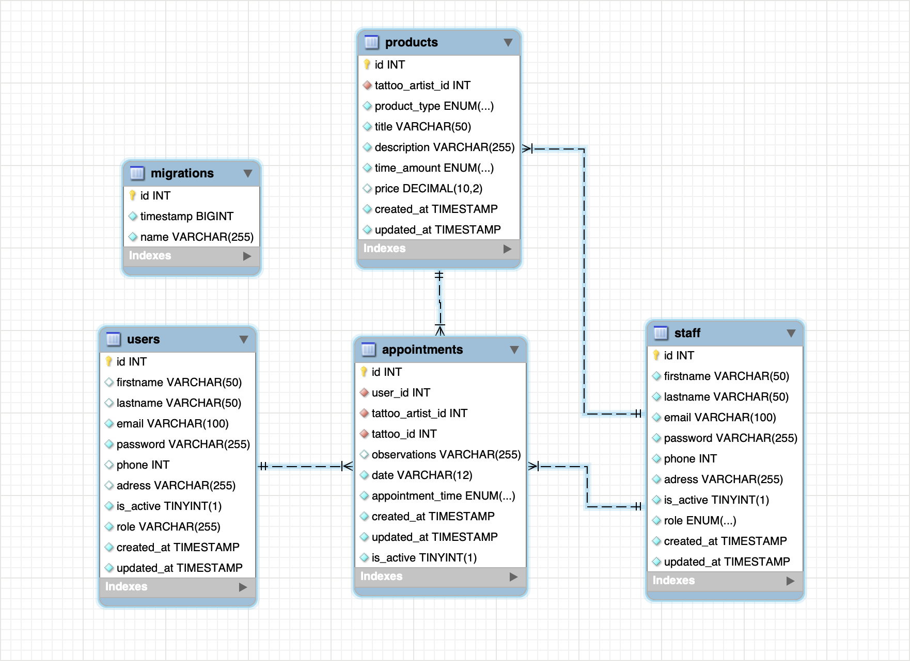

# Welcome to my backend app

<details>
  <summary>Contenido 📝</summary>
  <ol>
    <li><a href="#objetivo">Objetivo</a></li>
    <li><a href="#sobre-el-proyecto">Sobre el proyecto</a></li>
    <li><a href="#deploy-🚀">Deploy</a></li>
    <li><a href="#stack">Stack</a></li>
    <li><a href="#diagrama-bd">Diagrama</a></li>
    <li><a href="#instalación-en-local">Instalación</a></li>
    <li><a href="#endpoints">Endpoints</a></li>
    <li><a href="#futuras-funcionalidades">Futuras funcionalidades</a></li>
    <li><a href="#contribuciones">Contribuciones</a></li>
    <li><a href="#licencia">Licencia</a></li>
    <li><a href="#desarrollo">Desarrollo</a></li>
    <li><a href="#agradecimientos">Agradecimientos</a></li>
    <li><a href="#contacto">Contacto</a></li>
  </ol>
</details>

## Objetivo
Este proyecto de backend requería una API funcional conectada a una base de datos con al menos una relación de uno a muchos y una relación de muchos a muchos mediante una tabla intermedia.

## Sobre el proyecto
Applicacion de backend API REST para un sistema de gestion de trabajadores, usuarios y citas para un pequeño estudio de tatuaje.
Un administrador puede gestionar con este recurso su negocio añadiendo tatuadores a su plantilla y gestionando todo el contenido online.  

## Deploy 🚀
<div align="center">
    <a href="https://www.google.com"><strong>Url a producción proximamente ... </strong></a>🚀🚀🚀
</div>

## Stack
Tecnologías utilizadas:
<div align="center">
<a href="https://www.mysql.com/">
    
</a>
<a href="https://www.expressjs.com/">
    
</a>
<a href="https://nodejs.org/es/">
    
</a>
<a href="https://www.typescriptlang.org/">
    
</a>
<a href="https://jwt.io//">
    
</a>
<a href="https://www.postman.com/">
    
</a>
 </div>


## Diagrama BD


## Instalación en local
1. Clonar el repositorio y ejecutar el siguiente comando para instalar las dependencias necesarias:
2. ` $ npm install `
3. Conectamos nuestro repositorio con la base de datos siguiendo el archivo env.example, donde también se guarda la clave para el JWT.
4. ``` $ Ejecutamos las migraciones ``` 
5. ``` $ npm run dev ``` 
6. Ejecutar los endpoints desde postman con el http-tattoo-studio.postman_collection.json incluido en el directorio "./http"
7. Tambien puedes compilar a JavaScript y correr el proyecto con los siguientes comandos:
8. ``` $ npm run build ```
9. ``` $ npm run start ```

## Run in Postman

[](https://god.gw.postman.com/run-collection/30593617-05249675-7766-40ce-aea4-af483af6d4de?action=collection%2Ffork&source=rip_markdown&collection-url=entityId%3D30593617-05249675-7766-40ce-aea4-af483af6d4de%26entityType%3Dcollection%26workspaceId%3D624a1798-d9bc-4ee8-842a-0c53f919503d)

## Endpoints
<details>
<summary>Endpoints</summary>

- HELLO

            GET http://localhost:4000/helloworld 

- ADMIN ENDPOINTS

    - REGISTER ADMIN

            POST http://localhost:4000/register/admin
        body:
        ``` json
            {
                "firstname": "Juan Manuel",
                "lastname": "Apellido Aburrido",
                "email": "admin@admin.com",
                "password": "12345",
                "phone": "123456789",
                "adress": "Calle del Admin, 12, 3, 46011, Valencia, España",
                "role": "admin"
            }
        ```

    - LOGIN

            POST http://localhost:4000/staff/login
        body:
        ``` json
            {
                "email": "admin@admin.com",
                "password": "12345"
            }
        ```
    - REGISTER TATTOO ARTIST

            POST http://localhost:4000/staff/register
        body:
        ``` json
            {
                "firstname": "Juan Manuel",
                "lastname": "El Tuerto",
                "email": "juan@manuel.com",
                "password": "12345",
                "phone": "99999999",
                "adress": "Calle con número, n/a"
            }
        ```
        auth: role admin required

- TATTOO ARTISTS ENDPOINTS

    - LOGIN TATTOO ARTIST

            POST http://localhost:4000/staff/login
        body:
        ``` json
            {
                "email": "juan@manuel.com",
                "password": "12345"
            }
        ```
    - CREATE TATTOO

            POST http://localhost:4000/staff/addwork
        body:
        ``` json
            {
                "product_type": "tattoo",
                "title": "caravera",
                "description": "tatuaje de calavera del tamaño de una cara",
                "price": "99.99"
            }
        ```
        auth: role worker required

    - GET ALL MY APPOINTMENTES AS TATTOO ARTIST

            GET http://localhost:4000/staff/myappointments
        body:
        ``` json
        ```
        auth: role worker required

- TATTOO ARTISTS ENDPOINTS

    - REGISTER USER

            POST http://localhost:4000/user/register
        body:
        ``` json
            {
                "email": "juan@manuel.com",
                "password": "12345"
            }
        ```
        auth: 

    - LOGIN USER

            POST http://localhost:4000/user/login
        body:
        ``` json
            {
                "email": "juan@manuel.com",
                "password": "12345"
            }
        ```
        auth: 

     - UPDATE USER

            PUT http://localhost:4000/user/profile
        body:
        ``` json
            {
                "firstname": "Juan Manuel",
                "lastname": "Perez García",
                "email": "user@user.com",
                "password": "12345",
                "phone": "666333777",
                "adress": "Calle del user, 12, 3, 46011, Valencia, España"
            }
        ```
        auth: role user required

    - GET USER PROFILE

            GET http://localhost:4000/user/profile

        auth: role user required

    - CREATE APPOINTMENT

            POST http://localhost:4000/user/appointment
        body:
        ``` json
            {
                "tattoo_id": "1",
                "observations": "Lo quiero lo antes posible",
                "date": "10-11-2023"
            }
        ```
        auth: role user required

    - GET ONE APPOINTMENT

            GET http://localhost:4000/user/myappointments/:id

        auth: role user required

    - GET ALL MY APPOINTMENTS

            GET http://localhost:4000/user/myappointments/
        
    auth: role user required

    - UPDATE APPOINTMENT

            PUT http://localhost:4000/user/myappointments/:id
        body:
        ``` json
            {
                "observations": "Lo siento pero tengo que cambiar la fecha",
                "date": "12-11-2023"
            }
        ```
    auth: role user required

    - DELETE APPOINTMENT
    
           DEL http://localhost:4000/user/myappointments/:id

    auth: role user required


</details>
</details>

## Futuras funcionalidades
[ ] Añadir validaciones
[ ] Arreglar bug en la validación de fecha de la cita con DayJs
[ ] Arreglar bug por el cual al modificar una cita se puede añadir una fecha incorrecta.

## Contribuciones
Las sugerencias y aportaciones son siempre bienvenidas.  

Puedes hacerlo de dos maneras:

1. Abriendo una issue
2. Crea un fork del repositorio
    - Crea una nueva rama  
        ```
        $ git checkout -b feature/nombreUsuario-mejora
        ```
    - Haz un commit con tus cambios 
        ```
        $ git commit -m 'feat: mejora X cosa'
        ```
    - Haz push a la rama 
        ```
        $ git push origin feature/nombreUsuario-mejora
        ```
    - Abre una solicitud de Pull Request

## Licencia
Este proyecto se encuentra bajo una licencia MIT.


## Desarrollo:

Paco Fuentes. 2023

## Contacto
<a href = "mailto:pacofuentes.work@gmail.com"></a>
<a href="https://www.linkedin.com/in/paco-fuentes-805a40290/" target="_blank"></a> 
</p>
